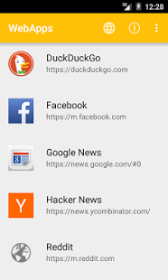
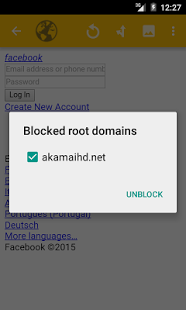
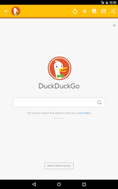

WebApps Sandboxed browser Android app
=====================================

**DEPRECATED** - This project is no longer maintained, due to reasons explained in [this issue](https://github.com/tobykurien/WebApps/issues/253)

  

WebApps allows you to save websites, as if they were apps! It provides a secure way to browse popular webapps by eliminating referrers, 3rd party requests, 3rd party cookies, insecure HTTP requests, etc.

It accomplishes this by providing a sandbox for multiple webapps (like Google's apps, Facebook, Twitter, etc.). Each webapp will run in it's own sandbox, with 3rd party requests (images, scripts, iframes, etc.) blocked, and all external links opening in an external default web browser (which should have cookies, plug-ins, flash, etc. disabled). All HTTP requests are blocked (only HTTPS allowed). This improves security, especially on untrusted networks. In addition, WebApps will warn you if the SSL certificate of the site you're viewing has changed to warn you of a possible man-in-the-middle attack.

For a less security-focussed, but more media-friendly option, try [Web Media Share][webmediashare], which is a fork of WebApps with specific focus on viewing and sharing/casting media.

<a href="https://play.google.com/store/apps/details?id=com.tobykurien.webapps" target="_blank">
  
</a>
<a href="https://f-droid.org/en/packages/com.tobykurien.webapps/" target="_blank">
  
</a>

[Grab the APK from releases](https://github.com/tobykurien/WebApps/releases)

Features
========

- Works like Mozilla Prism on the desktop. This is a mostly chrome-less browser that gets out of your way.
- Completely full-screen browsing (auto-hiding actionbar)
- Securely browse mobile sites (uses HTTPS only)
- Blocks 3rd party requests (images/scripts/iframes) like the NoScript, NotScripts, uMatrix, uBlock Origin plugins on the desktop
- Allows self-signed SSL certificates to be saved
- Warns if server SSL certificate changes (e.g. during man-in-the-middle-attack)
- User agent and text size setting (per site) allows more rich mobile experience (depending on site)
- External links (outside the domain of the site visited) open in your default browser
- Long-press links to choose how to open them
- Create shortcuts to your webapps on the homescreen
- Uses much less bandwidth than native apps (like Google+ app). No background sync'ing.
- Features local data storage and caching for reduced bandwidth usage and better speed.
- Fully open source software.

Cookies
=======

Cookies are stored by Android's [CookieManager][], of which there is one instance per app. To avoid cookies from passing between sandboxes, the following has been implemented:

- All cookies in the CookieManager are deleted when opening a URL or web app.
- For saved web apps, the saved cookies are restored, and the app opened.
- Cookies are only saved for the root domain of the saved web app, and made available to all sub-domains.
- No 3rd party cookies are saved or sent. This may prevent some sites from working correctly.

In short, there is a strict cookie policy in place that ensures that cookies are correctly sandboxed, and that no 3rd party cookies are saved or sent.

However, it should be noted that there are several techniques for storing unique identifiers, such as [evercookie](https://github.com/samyk/evercookie) AKA supercookies. Thus, the strongest protection this app provides is the blocking of 3rd party requests, which is why it is important to pick services that use the least amount of 3rd party requests, and try to unblock as few of them as possible. In particular, CDNs and other common 3rd party services such as CloudFlare, JQuery, Google Fonts, Google Analytics, etc. should be blocked as much as possible.

Referer
=======

Referer information is not send on any request (as per default behaviour of Webview), which may lead to problems on some sites, but improves privacy.

Storage
=======

Plugins, and local file access are disabled, however DOM/local storage and app caching is allowed. There is only one cache for all sandboxes to share, so this is potentially a way to leak information between sandboxes.

Location
========

Since WebApps v3.0, location access has been enabled. WebApps will prompt for location access per web app, the first time the app requests your location. You can then permanently allow or deny location access, with an option to reset the app should you change your mind.

Privacy warnings
================

WebApps sandboxing is not perfect:

- WebApps relies on Android System WebView (or Bromite if you have that installed) which may or may not make additional requests, send out identifying headers, implement FLoC or similar, etc.
- Evercookie/supercookies can leak information between sandboxes
- Browser fingerprinting can be used to identify our browser across domains
- The shared cache can be abused to leak information between sandboxes
- CNAME cloaking (see https://medium.com/nextdns/cname-cloaking-the-dangerous-disguise-of-third-party-trackers-195205dc522a) can be used to bypass 3rd-party content blocking, and is being increasingly used across the web

There are probably many more ways to leak identifying data across sites that I am not aware of.

Credits:
========

- New app icon by https://github.com/TacoTheDank, modified from the original by Steve Morris (https://thenounproject.com/term/sandbox/30514/)


Development
===========

## Libraries

This project makes use of the following libraries/tools:

- Xtend language compiler: http://xtend-lang.org
- Xtendroid library (an Android DSL): http://github.com/tobykurien/xtendroid
- Bumptech Glide: https://github.com/bumptech/glide
- Android Support library: https://developer.android.com/topic/libraries/support-library 

*NOTE*: There are many inter-dependencies between the various library versions, Gradle versions, Gradle plugin versions, Android SDK versions, and the JDK version (which has to be JDK 8 for Android)! Simply upgrading any one of these components is likely to cause a build failure, and this will not be easy to resolve.

## Build and run

To run a debug build of this project:

- Clone or download the git repository to your local machine (```git clone git@github.com:tobykurien/WebApps.git```)
- Run ```./debug.sh``` to build a debug APK and upload it to a connected device.

## VSCode

The easiest (although not the nicest) way to make changes to this app is to use VSCode and an [Xtend plugin](https://marketplace.visualstudio.com/items?itemName=Grammarcraft.xtend-lang). While you get basic syntax highlighting, you will get no code completion/intellisense/code navigation/Java docs/etc. It is a basic text editor. On the plus side, setup is very easy, and it is light on RAM (can work on a machine with only 4Gb RAM).

You can run `./debug.sh` after a code change to compile and run the app on an attached device. This is how this project is currently being maintained.

## Eclipse

Eclipse is the best development environment for this project, because it makes use of Xtend lang that is only supported in Eclipse. In order to develop in Eclipse:

- UPDATE: due to [this issue](https://github.com/tobykurien/WebApps/issues/212) the [Gradle android eclipse plugin](https://plugins.gradle.org/plugin/com.greensopinion.gradle-android-eclipse) had to be removed from the repo, so you will need to manually compile that gradle plugin with JDK8 and add it to the `app/build.gradle` file to continue. Alternatively, copy the compiled version from [here](https://github.com/tobykurien/WebApps/tree/v3.41/app/libs) and apply the plugin as in [build.gradle](https://github.com/tobykurien/WebApps/tree/v3.41/app/build.gradle). This plugin is needed to set up Eclipse to work with Android AAR dependencies.
- Install the [Xtend plugin for Eclipse][xtend_install]
- Clone the git repository to your local machine (```git clone ...```)
- Inside the checked-out folder, run: ```./gradlew eclipse```. This will download all the required 3rd party libraries and create the Eclipse classpath and project files
- Open Eclipse and import the project in the `app` folder using `File -> Import -> Gradle -> Existing Gradle Project` (not as a generic project)
- Right-click the "app" project -> Properties -> Add Variable -> Cionfigure Variables -> New
  - add a new variable called `ANDROID_HOME` and point it to the location of your android SDK installation
  - Apply and Close, and do a full re-build
- The project should now compile in Eclipse

## Android Studio

Development in Android Studio is not supported any longer, as the Xtend plugin for IntelliJ (https://plugins.jetbrains.com/plugin/8073-xtend-support) is not maintained.


   [webmediashare]: https://github.com/tobykurien/WebMediaShare
   [gapps]: https://github.com/tobykurien/GoogleNews
   [cookies]: https://developer.android.com/reference/android/webkit/WebSettings.html#setDatabasePath%28java.lang.String%29
   [sandbox_workaround]: https://github.com/tobykurien/WebApps/issues/3
   [xtend_install]: http://www.eclipse.org/xtend/download.html
   [CookieManager]: https://developer.android.com/reference/android/webkit/CookieManager.html
